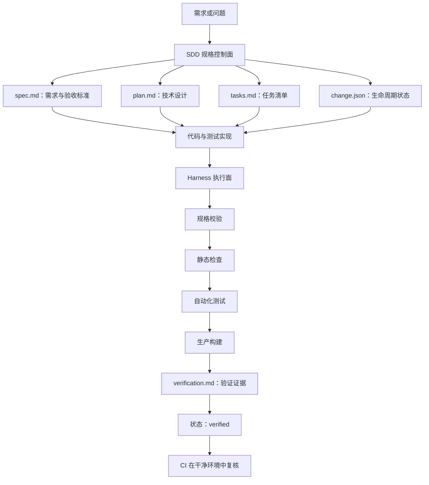
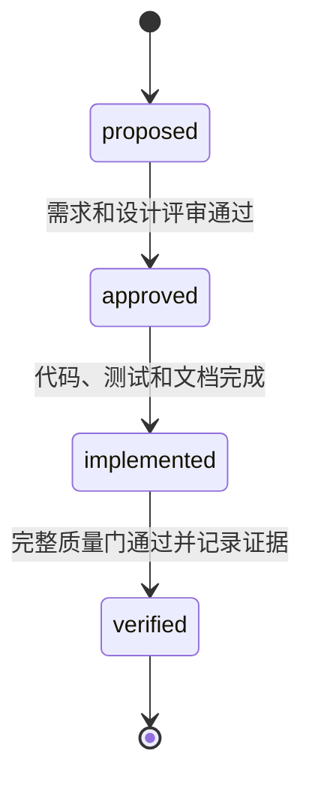
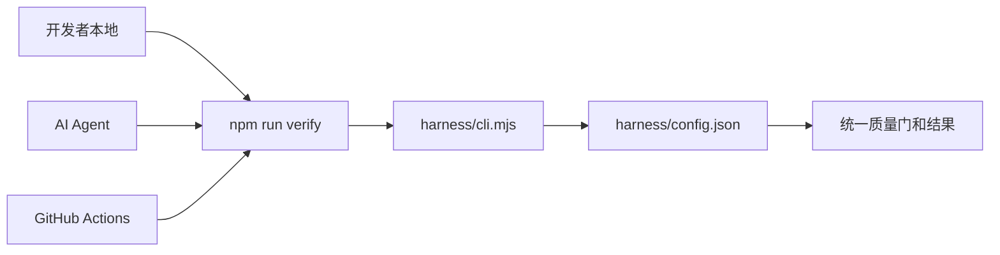

# SDD + Harness 架构设计与实现

> 面试讲解材料：用于说明本项目为什么引入 SDD + Harness、整体工作原理、工程实现、完整开发流程以及后续演进方向。

## 1. 一句话定义

这套架构是一套“规格驱动 + 自动化质量闭环”的研发体系：

- SDD 负责定义“为什么改、改什么、怎么验收”。
- Harness 负责执行“规格是否合法、代码是否合格、测试和构建是否通过”。
- CI 在干净环境中复用同一套 Harness，重新验证交付结果。
- 验证记录负责保存最终证据，让每次变更都可以追踪和复现。

可以将其概括为：

> SDD 是研发控制面，Harness 是研发执行面。SDD 定义正确性，Harness 自动验证正确性。

---

## 2. 为什么搭建这套架构

传统开发流程通常是：

```text
接收需求 -> 直接编码 -> 开发者自测 -> 提交代码
```

这种方式在项目持续迭代或引入 AI 辅助开发后，容易出现以下问题：

- 需求只存在于聊天记录或开发者个人理解中。
- 需求、设计、代码和测试之间缺少稳定的追踪关系。
- 开发过程中容易扩大范围，或者实现偏离原始目标。
- “代码已经写完”和“变更已经验证完成”没有明确区分。
- lint、测试和构建命令分散，开发者可能遗漏某些步骤。
- 本地开发和 CI 使用不同规则，导致本地通过、CI 失败。
- 后续维护者无法知道某个架构决策当时为什么这样设计。
- AI Agent 缺少需求边界、架构约束和完成标准，容易产生范围漂移。

引入 SDD + Harness 后，流程变为：

```text
需求规格
   -> 技术设计
   -> 评审批准
   -> 任务拆分
   -> 代码与测试
   -> 自动化质量门
   -> 验证证据
   -> 变更完成
```

目标不是增加文档数量，而是让每次变更都能明确回答三个问题：

1. 为什么要改？
2. 应该怎么改？
3. 如何证明改对了？

---

## 3. 整体工作原理

### 3.1 控制面与执行面



SDD 和 Harness 不是两套互相独立的工具，它们通过以下内容连接：

- `change.json` 提供机器可读的状态。
- Markdown 规格提供人可读的需求、设计和验收标准。
- Harness 校验状态、文件和必要章节是否完整。
- 测试和构建结果写入 `verification.md`，形成验证证据。
- 状态变为 `verified` 时，Harness 会执行更严格的不变量检查。

### 3.2 三个闭环

整个体系包含三个相互连接的闭环。

#### 需求闭环

```text
背景 -> 目标 -> 非目标 -> 需求 -> 验收标准
```

它保证需求不是一句模糊描述，而是可以观察和验证的结果。

#### 实现闭环

```text
技术设计 -> 影响分析 -> 任务拆分 -> 代码实现 -> 自动化测试
```

它保证实现过程有明确路径，并且能够控制变更范围。

#### 交付闭环

```text
Harness 验证 -> 记录证据 -> 状态 verified -> CI 再验证
```

它保证“完成”不是口头结论，而是可以重复执行和复核的事实。

---

## 4. SDD 的具体实现

### 4.1 变更目录

每个有实际意义的变更都拥有独立目录：

```text
specs/changes/<change-slug>/
├── change.json
├── spec.md
├── plan.md
├── tasks.md
└── verification.md
```

五个文件对应研发流程中的五个核心问题：

| 文件 | 作用 | 回答的问题 |
| --- | --- | --- |
| `change.json` | 记录变更身份和状态 | 当前处于哪个阶段？ |
| `spec.md` | 记录需求和验收标准 | 为什么改、改什么？ |
| `plan.md` | 记录技术方案 | 准备怎么改？ |
| `tasks.md` | 记录执行任务 | 需要完成哪些步骤？ |
| `verification.md` | 记录验证结果 | 如何证明已经改对？ |

### 4.2 生命周期状态机



状态含义如下：

| 状态 | 中文含义 | 进入条件 |
| --- | --- | --- |
| `proposed` | 提议中 | 已创建变更，正在完善需求和设计 |
| `approved` | 已批准 | 范围、验收标准和技术方案已经评审 |
| `implemented` | 已实现 | 代码、测试和文档已经完成 |
| `verified` | 已验证 | 任务全部完成，验证证据完整，Harness 通过 |

这里特意将 `implemented` 和 `verified` 分开：

> 代码写完只表示实现结束，不代表已经证明实现满足需求。

状态值保留英文，因为它们是供 Harness 读取的稳定机器接口；中文文档负责解释其业务含义。

### 4.3 `change.json`：机器可读状态

```json
{
  "id": "document-search",
  "title": "文档搜索",
  "status": "proposed",
  "created": "2026-07-17",
  "updated": "2026-07-17"
}
```

Harness 可以通过它检查：

- 必要字段是否存在。
- JSON 是否能够解析。
- `id` 是否与目录名称一致。
- `status` 是否属于允许的状态集合。
- 已验证变更是否满足额外约束。

### 4.4 `spec.md`：定义做什么

规格包含固定章节：

```text
背景
目标
非目标
需求
验收标准
```

“非目标”用于控制范围。例如增加文档搜索时，可以明确：

```markdown
## 非目标

- 本次不引入 Elasticsearch。
- 本次不实现搜索历史。
- 本次不修改数据库结构。
```

验收标准需要写成可观察结果：

```markdown
- [ ] 假如存在标题为“Go 并发”的文档，
      当用户输入“并发”时，
      那么搜索结果中应展示该文档。
```

这使验收标准可以直接映射到自动化测试或明确的人工检查。

### 4.5 `plan.md`：定义怎么做

设计文档包含：

```text
设计方案
影响范围
测试策略
发布与回滚
```

它要求开发者在编码前回答：

- 哪些组件需要修改？
- 数据和控制流如何变化？
- 是否增加或修改 API？
- 是否影响数据库结构和历史数据？
- 是否保持向后兼容？
- 如何验证每条验收标准？
- 如何发布，出现问题时如何回滚？

### 4.6 `tasks.md`：将设计转换成执行计划

```markdown
- [x] 完成需求和设计评审。
- [x] 实现后端查询能力。
- [x] 实现前端搜索交互。
- [x] 添加自动化测试。
- [ ] 运行完整 Harness。
- [ ] 记录验证证据。
```

它连接技术设计和代码实现，同时帮助开发者或 AI Agent 控制任务范围。

### 4.7 `verification.md`：保存完成证据

```markdown
## 验证摘要

文档搜索已完成，验收标准全部满足。

## 验证证据

- `npm run spec:check`：通过。
- `npm run check`：通过。
- `npm test`：通过。
- `npm run build`：通过。
- 标题搜索验收标准：由 `documents.test.mjs` 覆盖。
```

已完成的规格不会删除，而是作为需求和架构决策历史保留在仓库中。

---

## 5. Harness 的具体实现

### 5.1 目录结构

```text
harness/
├── cli.mjs
├── config.json
└── README.md
```

职责如下：

| 文件 | 职责 |
| --- | --- |
| `cli.mjs` | 命令解析、规格校验、流程编排、子进程执行和失败处理 |
| `config.json` | 声明开发工具和各阶段质量门 |
| `README.md` | 说明 Harness 的使用方法 |

根目录 `package.json` 暴露统一入口：

```json
{
  "scripts": {
    "doctor": "node ./harness/cli.mjs doctor",
    "spec:new": "node ./harness/cli.mjs new",
    "spec:check": "node ./harness/cli.mjs spec-check",
    "check": "node ./harness/cli.mjs check",
    "test": "node ./harness/cli.mjs test",
    "build": "node ./harness/cli.mjs build",
    "verify": "node ./harness/cli.mjs verify"
  }
}
```

### 5.2 为什么采用配置驱动

每个质量门在 `config.json` 中声明，例如：

```json
{
  "name": "后端测试",
  "command": "go",
  "args": ["test", "./..."],
  "cwd": "backend"
}
```

执行器只处理统一的命令结构：

```text
读取 command、args 和 cwd
           ↓
进入对应工作目录
           ↓
启动子进程
           ↓
读取退出码和输出
           ↓
判定质量门成功或失败
```

这种设计将“执行机制”和“具体检查工具”分离。以后增加安全扫描时，可以在配置中增加：

```json
{
  "name": "Go 漏洞扫描",
  "command": "govulncheck",
  "args": ["./..."],
  "cwd": "backend"
}
```

不需要重写整个流程执行器。

### 5.3 跨平台原理

Harness 使用 Node.js 的 `spawnSync` 启动子进程，而不是依赖 Bash 或 PowerShell：

```text
Node.js Harness
      ↓ spawnSync
go / npm / eslint / vite
```

因此同一套逻辑可以运行在：

- Windows 本地开发环境。
- Linux GitHub Actions。
- 其他开发者工作站。
- AI Agent 执行环境。

Windows 中 npm 的可执行文件是 `npm.cmd`，Harness 会根据操作系统自动转换，解决平台差异。

### 5.4 快速失败机制

完整验证的控制逻辑相当于：

```javascript
specCheck()
  && runCheckGate()
  && runTestGate()
  && runBuildGate();
```

执行顺序为：

```text
规格校验 -> 静态检查 -> 自动化测试 -> 生产构建
```

任何阶段失败，后续阶段不再执行。这种 fail-fast 设计能够：

- 尽早暴露根本问题。
- 避免无意义的后续执行。
- 减少 CI 时间和资源消耗。
- 让失败输出更容易定位。

### 5.5 退出码和输出判定

通常情况下，Harness 根据子进程退出码判断成功与否：

```text
退出码 0：成功
非 0：失败
```

Go 格式检查是一个特殊场景：

```powershell
gofmt -l .
```

即使存在未格式化文件，该命令也可能返回成功，但会输出文件名。因此配置增加：

```json
"expectEmptyOutput": true
```

最终判断规则是：退出码必须为 0，并且标准输出必须为空。

---

## 6. 规格校验器的工作原理

`npm run spec:check` 是 SDD 与 Harness 连接的关键位置。

### 6.1 遍历变更目录

Harness 遍历：

```text
specs/changes/
```

以下划线开头的目录作为模板或内部目录跳过，其余目录逐个检查。

### 6.2 校验变更清单

对每个 `change.json` 检查：

- 文件是否存在。
- JSON 格式是否合法。
- `id`、`title`、`status`、`created`、`updated` 是否存在。
- `id` 是否与目录名一致。
- 状态是否属于 `proposed`、`approved`、`implemented`、`verified`。

### 6.3 校验规格文件和章节

必须存在以下文件：

```text
spec.md
plan.md
tasks.md
verification.md
```

`spec.md` 必须包含：

```text
背景、目标、非目标、需求、验收标准
```

`plan.md` 必须包含：

```text
设计方案、影响范围、测试策略、发布与回滚
```

这可以避免出现“文件名正确，但内容结构为空”的伪规格。

### 6.4 校验 `verified` 状态的不变量

当变更状态为 `verified` 时，Harness 额外检查：

- `tasks.md` 中不能存在 `- [ ]` 未完成项。
- `verification.md` 中不能存在 `TODO`。
- `verification.md` 中不能存在“待补充”。

因此 `verified` 不是开发者随意填写的标签，而是必须满足对应文档约束。

---

## 7. 完整开发流程

### 阶段一：环境自检

首次配置环境时执行：

```powershell
npm run doctor
```

检查内容包括：

- Node.js
- npm
- Go
- Git
- 前端依赖

### 阶段二：创建变更

```powershell
npm run spec:new -- document-search "文档搜索"
```

调用过程：

```text
npm script
   -> harness/cli.mjs new
   -> 读取 specs/_template/
   -> 替换 ID、标题和日期
   -> 生成 specs/changes/document-search/
```

新变更状态默认为 `proposed`。

### 阶段三：填写需求规格

完善 `spec.md`，明确：

- 问题背景。
- 目标和非目标。
- 可以测试的需求。
- 可以观察的验收标准。

这个阶段需要回答：

> 如果代码还没有出现，应该如何判断最终结果是否正确？

### 阶段四：填写技术方案

完善 `plan.md`，明确：

- 组件和数据流。
- API、数据库和配置影响。
- 兼容性和安全影响。
- 测试策略。
- 发布和回滚方案。

### 阶段五：评审批准

需求和设计评审通过后，将状态改为：

```json
"status": "approved"
```

当前版本中，“未批准不得实现”主要由 `AGENTS.md` 和代码评审流程约束；Harness 会检查状态是否合法，但还没有持久化历史状态，因此暂时不能完全阻止跳过中间状态。

### 阶段六：拆分任务和实现垂直切片

根据设计维护 `tasks.md`，按照最小垂直切片实现：

```text
前端交互
   -> API 契约
   -> Handler
   -> Service
   -> Model / Database
   -> 自动化测试
```

这样每个小阶段都可以形成可运行、可验证的结果。

### 阶段七：持续快速反馈

开发过程中执行：

```powershell
npm run check
npm test
```

`npm run check` 包含：

```text
规格校验 + Go 格式检查 + Go vet + 前端 ESLint
```

`npm test` 包含：

```text
Go 单元测试 + 前端单元测试
```

### 阶段八：标记实现完成

代码、测试和文档完成后，将状态改为：

```json
"status": "implemented"
```

这个状态只表示实现结束，尚未表示交付完成。

### 阶段九：运行完整验证

```powershell
npm run verify
```

完整调用链：

```text
npm run verify
   -> node harness/cli.mjs verify
      -> spec-check
      -> check
         -> gofmt -l .
         -> go vet ./...
         -> eslint
      -> test
         -> go test ./...
         -> node --test
      -> build
         -> go build ./...
         -> vite build
```

### 阶段十：记录证据并完成变更

在 `verification.md` 中记录：

- 验收标准与测试之间的对应关系。
- 实际执行的命令、日期和结果。
- 必要的人工验证或截图。
- 已知但不阻塞交付的剩余风险。

完成所有任务后，将状态改为：

```json
"status": "verified"
```

再次运行 `npm run verify`，确认已验证状态下的全部不变量仍然成立。

---

## 8. Harness 当前质量门

| 阶段 | 后端 | 前端 | 目的 |
| --- | --- | --- | --- |
| 规格 | `spec-check` | `spec-check` | 检查变更结构和完成状态 |
| 静态检查 | `gofmt -l .`、`go vet ./...` | ESLint | 发现格式、语法和静态问题 |
| 测试 | `go test ./...` | `node --test` | 验证业务行为和纯函数 |
| 构建 | `go build ./...` | `vite build` | 验证生产构建可用性 |

当前后端测试覆盖了 Service 层的输入规范化和业务校验；前端测试覆盖了 Markdown 标题提取、重复标题 ID 和分类规范化等纯函数。

---

## 9. 本地、AI Agent 与 CI 如何统一



GitHub Actions 不重新实现一套验证逻辑，只负责：

1. 拉取代码。
2. 安装 Go 和 Node.js。
3. 安装前端依赖。
4. 执行 `npm run verify`。

这样只有一个质量规则来源：

```text
harness/cli.mjs + harness/config.json
```

CI 的角色不是另一套质量系统，而是：

> Harness 在远程干净环境中的执行者。

---

## 10. SDD 与项目运行时架构的关系

项目运行时架构为：

```text
React 前端
    -> HTTP
Gin Router / Handler
    ->
Service
    ->
Model / Database
    ->
MySQL
```

职责边界如下：

- 前端负责展示、浏览器状态和 API 调用。
- Handler 负责 HTTP 参数、状态码和响应转换。
- Service 负责业务规则和用例。
- Model 负责持久化实体。
- Database 包负责数据库连接策略。

SDD 的 `plan.md` 会说明本次变更影响哪些层，Harness 则负责验证受影响层的代码质量和测试。

例如“文档标题不能为空”：

- 前端可以提供用户体验提示。
- Handler 负责解析输入。
- Service 必须执行真正的业务校验。
- Model 只描述持久化结构。

即使前端进行了校验，Service 仍然需要校验，因为前端不是可信的业务或安全边界。

---

## 11. `AGENTS.md` 的作用

`AGENTS.md` 是开发者和 AI Agent 共用的仓库级协作协议，规定：

- 开始任务前需要读取哪些上下文。
- 哪些变更必须创建规格。
- 什么状态下可以开始实现。
- 前后端各层的职责边界。
- 交付前必须运行哪些命令。
- 哪些生成文件和敏感信息不能提交。

需要区分两类规则：

| 规则类型 | 例子 | 实现方式 |
| --- | --- | --- |
| 可机器判断 | 缺少规格章节、测试失败、任务未完成 | Harness 和 CI 强制执行 |
| 需要语义判断 | 需求是否合理、设计是否合适、是否允许开始实现 | `AGENTS.md`、人工或 AI 评审 |

因此 `AGENTS.md` 不是 Harness 的替代品，而是补充机器无法完全判断的语义规则。

---

## 12. 示例：增加文档搜索

### 12.1 创建规格

```powershell
npm run spec:new -- document-search "文档搜索"
```

### 12.2 编写需求

```markdown
## 目标

- 用户可以按照标题关键字搜索文档。

## 非目标

- 不引入全文检索服务。
- 不实现搜索历史。
- 不修改数据库结构。

## 验收标准

- [ ] 输入标题中的关键字时，只展示匹配文档。
- [ ] 清空关键字时，恢复全部文档。
- [ ] 没有匹配结果时，展示空状态。
```

### 12.3 编写设计

```markdown
## 设计方案

前端维护搜索关键字状态，将过滤逻辑提取为纯函数，使用 useMemo 计算结果。
本次不新增后端接口，也不修改数据库。

## 测试策略

- 测试部分标题匹配。
- 测试空关键字。
- 测试没有匹配项。
```

### 12.4 执行状态流转

```text
proposed
   -> 需求和设计评审
approved
   -> 编码、测试和文档
implemented
   -> npm run verify + 验证证据
verified
```

这就是一次完整的 SDD + Harness 变更闭环。

---

## 13. 与 TDD、CI/CD 的关系

### 13.1 与 TDD 的关系

SDD 和 TDD 解决不同层面的问题：

- SDD 定义变更级别的需求和验收标准。
- TDD 通过测试驱动代码级别的设计和实现。
- Harness 统一执行规格检查和测试。

组合关系为：

```text
SDD 定义需求和验收标准
          -> TDD 将标准细化成测试
          -> 编写最小实现使测试通过
          -> Harness 执行完整验证
```

### 13.2 与 CI/CD 的关系

- Harness 定义和执行质量门。
- CI 在远程环境中调用 Harness。
- CD 可以在 Harness 通过后继续执行部署。

因此 Harness 位于开发流程和 CI/CD 之间，是质量规则的统一承载层。

---

## 14. 当前边界与后续演进

面试时应准确说明当前实现的能力边界。

### 14.1 生命周期转换还没有完全强制

当前 Harness 能检查状态是否合法，但没有保存状态历史，因此不能完全阻止：

```text
proposed -> verified
```

当前主要依靠 `AGENTS.md` 和评审流程约束。后续可以：

- 在 CI 中读取 Git diff 前后的状态。
- 建立合法状态转换表。
- 增加 `approvedBy` 和审批时间。
- 拒绝跳过必要阶段的变更。

### 14.2 规格内容质量仍需要评审

Harness 可以检查“验收标准”章节是否存在，但不能完全判断验收标准是否合理。

可以进一步增加：

- Requirement ID，例如 `R1`、`R2`。
- 测试与 Requirement ID 的自动映射。
- 规格评审清单。
- AI 辅助规格审查。

### 14.3 测试体系仍可扩展

当前主要是单元测试，后续可以增加：

- MySQL 集成测试。
- API 契约测试。
- 前后端端到端测试。
- Docker Compose 冒烟测试。
- 数据迁移和回滚测试。
- 覆盖率阈值。

### 14.4 质量门可以继续增强

- `govulncheck` 或依赖漏洞扫描。
- Docker 镜像安全扫描。
- API Schema 兼容性检查。
- 性能预算和前端包体积阈值。
- 数据库迁移检查。

当前方案优先建立最小可运行闭环，再根据项目风险逐步增强门禁，避免一开始引入过重流程。

---

## 15. 面试现场演示建议

### 第一步：生成变更

```powershell
npm run spec:new -- interview-demo "面试演示功能"
```

展示自动生成的五个文件和默认 `proposed` 状态。

### 第二步：制造规格错误

暂时删除 `spec.md` 中的一个必要章节，然后执行：

```powershell
npm run spec:check
```

展示 Harness 能拒绝结构不完整的规格。

### 第三步：展示已验证不变量

将状态设为 `verified`，但在 `tasks.md` 中保留未完成项，再次执行校验，展示 Harness 拒绝不一致状态。

### 第四步：运行完整质量门

恢复临时修改后执行：

```powershell
npm run verify
```

展示规格、静态检查、测试和构建使用同一个入口。

演示结束后删除临时演示规格，避免把无意义记录留在仓库中。

---

## 16. 五分钟面试讲稿

> 我在这个项目中搭建了一套 SDD 加 Development Harness 的研发体系，主要解决需求和实现缺少追踪、本地与 CI 质量规则不一致，以及代码完成后缺少验证证据的问题。
>
> 我把它分成控制面和执行面。SDD 是控制面，负责定义为什么改、改什么、不改什么、技术上怎么实现以及如何验收。Harness 是执行面，负责自动检查规格、代码、测试和生产构建。
>
> 每个有实际意义的变更都有独立目录，里面包含五个文件。`change.json` 保存机器可读的生命周期状态；`spec.md` 保存背景、目标、非目标、需求和验收标准；`plan.md` 保存设计方案、影响范围、测试策略和回滚方案；`tasks.md` 保存任务清单；`verification.md` 保存最终验证证据。
>
> 变更生命周期分为 `proposed`、`approved`、`implemented` 和 `verified`。我特意将 implemented 和 verified 分开，因为代码写完不等于已经证明代码满足需求。只有任务完成、证据记录完整并且完整 Harness 通过后，状态才进入 verified。
>
> 创建功能时，先运行 `npm run spec:new`。Harness 会读取统一模板，生成完整规格目录。开发者先完善需求、非目标和验收标准，再编写技术设计和测试策略。评审通过后状态进入 approved，然后按照任务清单实现最小垂直切片。
>
> 开发过程中使用 `npm run check` 和 `npm test` 获得快速反馈。实现完成后运行 `npm run verify`。这个命令会先校验所有变更规格，然后执行 Go 格式检查、Go vet 和前端 ESLint，再运行前后端测试，最后执行前后端生产构建。任何一步失败都会立即终止。
>
> Harness 使用一个无第三方运行时依赖的 Node CLI 实现，质量门在 JSON 中声明，CLI 负责读取配置并通过子进程执行。这样执行机制和具体工具是分离的，将来增加安全扫描通常只需要增加配置。使用 Node 而不是 Shell 脚本，是为了让同一套逻辑同时运行在 Windows 本地和 Linux CI 中。
>
> 规格校验器会检查变更清单、状态、必要文件和章节。状态为 verified 时，还会检查任务中是否存在未完成项，以及验证记录中是否还存在 TODO 或“待补充”。所以 Markdown 不只是说明文档，而是人可以阅读、机器也可以检查的工程资产。
>
> GitHub Actions 不再维护另一套验证逻辑，它只安装环境并调用同一个 `npm run verify`。因此本地开发、AI Agent 和 CI 共用同一套质量规则，CI 本质上是 Harness 在远程干净环境中的执行者。
>
> 最终这套体系形成三个闭环：背景、目标、需求和验收标准形成需求闭环；设计、任务、代码和测试形成实现闭环；Harness、验证证据和 verified 状态形成交付闭环。
>
> 当前版本是最小可运行闭环。下一步可以增加非法状态跳转检测、Requirement ID 与测试映射、API 契约测试、数据库集成测试和安全扫描。我的目标不是增加文档负担，而是让每次变更都能回答为什么改、怎么改，以及如何证明改对了。

---

## 17. 高频追问与回答

### 17.1 为什么不只使用 Jira 或普通需求文档？

Jira 更适合项目管理，但需求与代码仓库容易分离。这里将关键规格和代码放在同一个版本历史中，并通过 Harness 进行机器校验。两者并不冲突：Jira 可以管理团队进度，仓库规格负责工程事实和验证证据。

### 17.2 这会不会增加很多文档成本？

模板和脚手架降低了创建成本；小型错别字或不改变行为的重构不强制创建规格。只有用户行为、API、数据、安全、依赖、部署和架构变更需要完整规格。流程复杂度与变更风险匹配。

### 17.3 Harness 和测试框架有什么区别？

测试框架只验证某类代码行为；Harness 编排规格检查、静态检查、测试和构建，管理的是完整交付质量门。Go Test、Node Test 和 ESLint 都是 Harness 调用的底层工具。

### 17.4 为什么用 Node.js 实现 Harness？

项目本身已有 Node.js 前端工具链，Node 子进程 API 可以跨 Windows 和 Linux 使用，并且不需要再引入 Python 等运行时。Harness 本身没有第三方运行时依赖。

### 17.5 如何保证开发者不绕过 Harness？

本地主要依靠开发约定；远程通过 Pull Request 的 CI 必须执行 `npm run verify`。如果将 CI 设置为受保护分支的必需检查，未通过 Harness 的变更无法合并。

### 17.6 SDD 是否会限制快速迭代？

SDD 不是要求所有任务都写大型设计文档。规格深度应与风险匹配。模板的作用是确保即使快速迭代，也至少明确目标、非目标和验收标准，减少返工通常比直接编码更快。

### 17.7 规格发生变化怎么办？

先修改 `spec.md` 和 `plan.md`，更新 `updated` 日期并重新评审，然后同步调整任务、代码和测试。规格与代码一起进入版本控制，因此变更过程可以追踪。

### 17.8 当前最大的不足是什么？

目前生命周期状态缺少历史转换校验，规格内容质量仍需要人工评审，测试也以单元测试为主。这些边界是明确的，后续会按照风险增加状态机校验、需求与测试映射、集成测试和安全门禁。

---

## 18. 最终总结

```text
SDD 定义完成标准
        ↓
Harness 执行完成标准
        ↓
CI 在干净环境中复核完成标准
        ↓
verification.md 保存完成证据
```

这套架构的核心价值是：

- 需求、设计、实现、测试和证据可以相互追踪。
- 本地、AI Agent 和 CI 使用同一个质量入口。
- “代码写完”和“交付已验证”被明确区分。
- 架构决策和变更原因能够长期保留。
- 可以根据项目风险持续扩展质量门，而不需要推翻现有流程。

面试结束时可以用一句话概括：

> 我不是单独增加了一套文档，也不是单独写了一个测试脚本，而是把规格、实现、验证和证据连接成了一个可以执行、可以追踪、可以持续演进的工程闭环。

